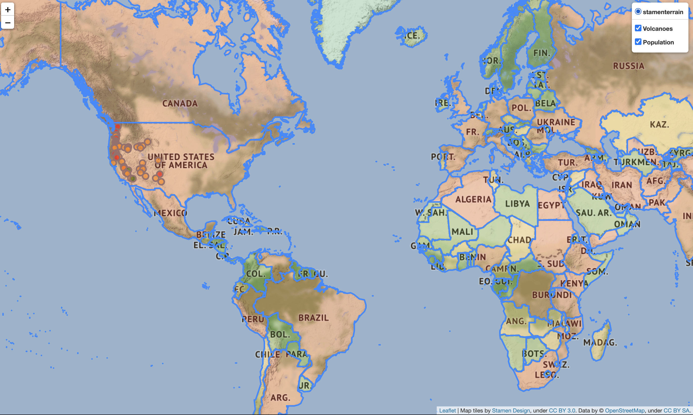

# web-map
I built this web map using Folium and Python. The map has multiple layers - one showing the population of counturies and another one displaying markers for the volcanoes in the USA. When the marker of a specific volcano is clicked the popup shows displaying its elevation in meters. I introduce layer control (in the top right corner of the map) through which you can select which layers will be displayed.

Countries are color coded depending on the population: green -> population less than 10mil, orange if population is between 10mil and 20mil and red if the population is greater than 20mil.

Volcanoes' markers are as well color coded depending on the elevation: green if elevation is less than 1000m, orange if betweeen 1000m and 3000m and red if the elevation is greater than 3000m.

# installation
Clone the repo, in the terminal run the map1.py file and open the Map1.html file.

# screenshot

